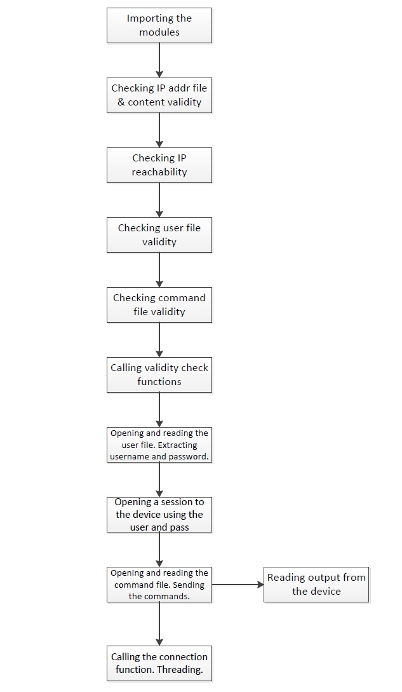

# R/W DEVICE CONFIG VIA SSH APPLICATION

## Overview:

This Python application will read and write Network Device Configurations via SSH.

## Functions
1. Read and write configuration files on multiple network devices
2. Automatic checking for:
    - user file is existing
    - syntax of the command input
    - ip validity (does not include IP range from Loopback, Multicast, Broadcast, Link-local, and Reserved for future use)
    - reachability, through pinging
3. Parse and extract command outputs or logs

## Logical Flow Diagram

