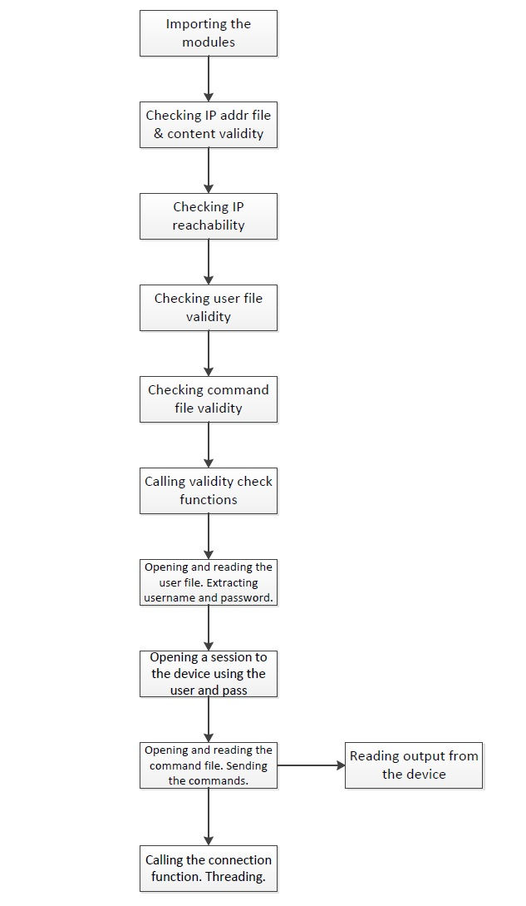

---
markmap:
    colorFreezelevel: 10
---

# R/W DEVICE CONFIG VIA SSH APPLICATION

## Overview:

This Python application will be used to read and write Network Device Configurations via SSH.

## Imports

### Check if IP file is valid
### Check if IP address is valid
### Check if IP is reacheable
### Create Threads
### SHH Connection
#### Check if User is existing/valid
#### Check if CMD file is existing/valid
#### Establish SSH Connection
